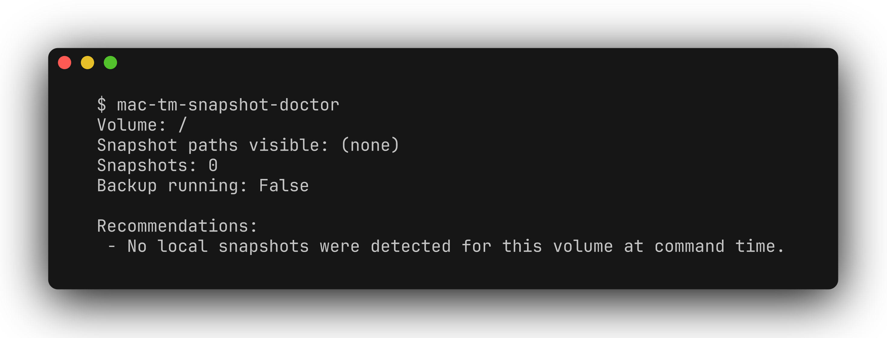

# mac-tm-snapshot-doctor

[](https://github.com/zhuhroscar-tech/mac-tm-snapshot-doctor/releases/tag/v0.1.0)

A tiny macOS CLI for diagnosing Time Machine local snapshots that can help with eject/space issues.

## Simple explanation

Time Machine sometimes leaves hidden "local snapshots" on your Mac that quietly
eat up disk space or block a drive from being ejected. This tool lists those
snapshots and tells you what state Time Machine is in, in plain language, so
you know what's safe to clean up. It never deletes anything on its own — it
only reports and suggests commands for you to run yourself.



```text
$ mac-tm-snapshot-doctor
Volume: /
Snapshot paths visible: (none)
Snapshots: 0
Backup running: False

Recommendations:
 - No local snapshots were detected for this volume at command time.
```

## Why this tool exists

Community threads repeatedly show users blocked by Time Machine snapshots and backup state:

- "Cannot delete snapshots" on Apple Support communities
- Stuck or failing local snapshots consuming hidden system space

This tool does not delete data by default. It only reports state and prints safe, explicit commands for manual follow-up.

## Features

- List Time Machine local snapshots for a volume (`tmutil listlocalsnapshots`).
- Read `tmutil status` to detect active backup phases.
- Detect common snapshot mount paths and mounted backup-related volumes.
- Produce JSON for scripting and automation.
- Suggest conservative remediation steps.

## Install

```bash
python3 -m pip install mac-tm-snapshot-doctor
```

## Usage

```bash
# Summary report
mac-tm-snapshot-doctor

# List snapshots as JSON
mac-tm-snapshot-doctor list --volume / --json

# Report for a specific path
mac-tm-snapshot-doctor health --volume / --json
```

## Contributing

Open issues/patches at the project GitHub page.
